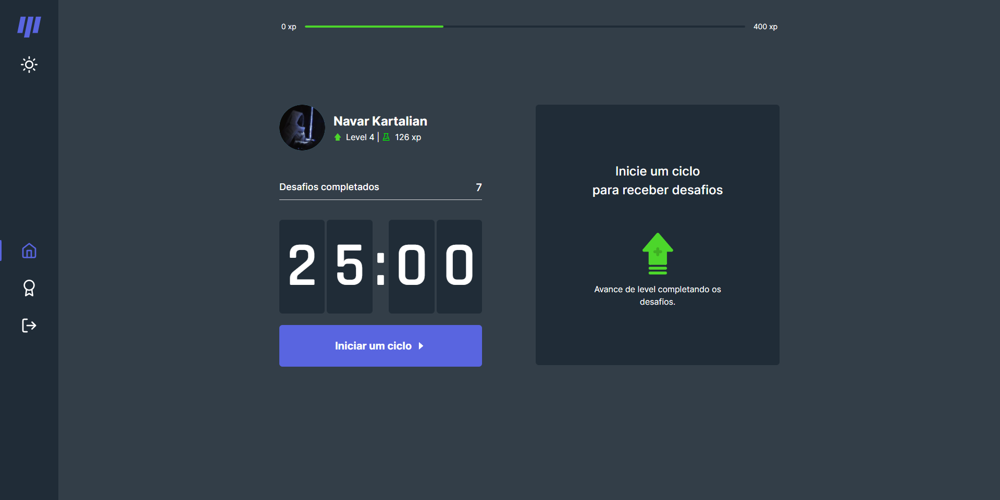
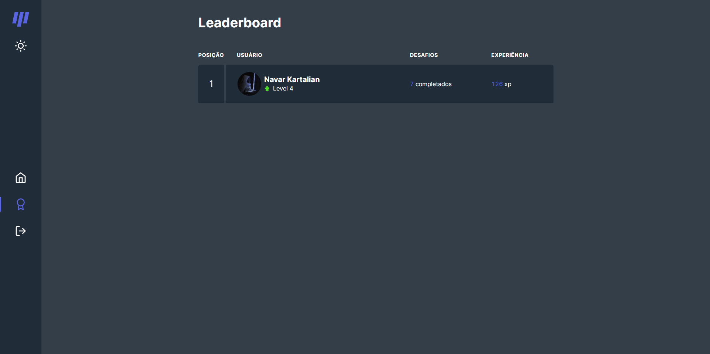

<h1 align="center">Moveit - Rocketseat NLW 4 project</h1>

---

---

## Be Welcome!

This project was developed during the NLW 4 of [Rocketseat](https://www.rocketseat.com.br/), this is a 2.0 version with authentication and database integration

## The Project

Moveit remind you to exercise on work! 💪

For those people that pass a lot of time in front of a screen, Moveit have some exercises for your body and eyes, it also have a Leaderboard in which you can check the other users progress

## Links

- Live Site: [Moveit](https://moveit-nlw-next.vercel.app/)
- Rocketseat: [Rocketseat](https://www.rocketseat.com.br/)

## Built with

- [React](https://reactjs.org/) - JS library
- [Next.js](https://nextjs.org/) - React framework
- [Chakra UI](https://chakra-ui.com/) - For structure and styles 
- [React Icons](https://react-icons.github.io/react-icons/) - Library with a great diversity of icons 
- [Axios](https://axios-http.com/docs/intro) - Used to make the request to the api
- [FaunaDB](https://fauna.com/) - Database
- [NextAuth](https://next-auth.js.org/) - Authentication for Next.js

## Useful resources

- [Dynamic Routes](https://nextjs.org/learn/basics/dynamic-routes) - Next doc about dynamic routes 
- [API Routes](https://nextjs.org/learn/basics/api-routes) - Next tutorial about Api routes 

## Author

- Linkedin - [Navar Kartalian](https://www.linkedin.com/in/navar-kartalian-784637206/)